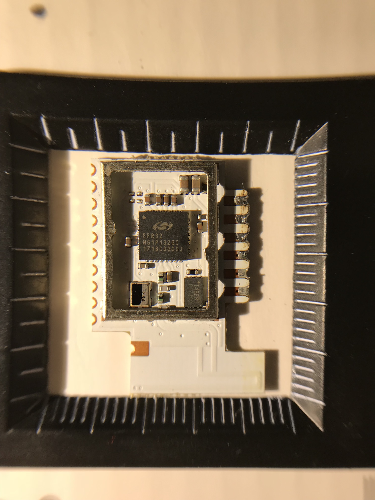
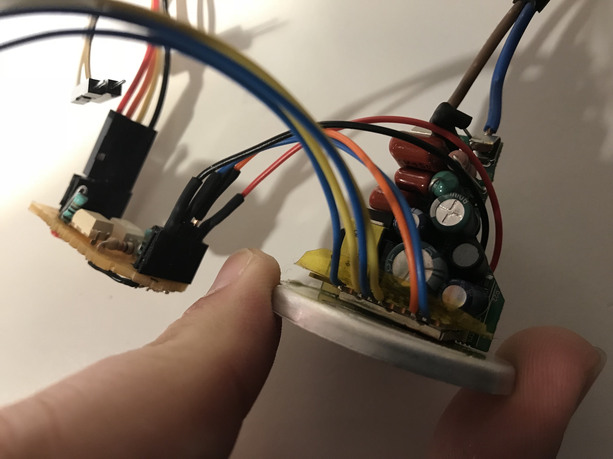

# Hacking the IKEA TRÅDFRI

* [Introduction](#introduction)
* [Pinout](#pinout)
* [Flashing using JTAG](#flashing)
* [Software](#software)
* [Custom firmware](#custom-firmware)
* [Isolation](#isolation)
* [Pictures](#pictures)
* [Relevant sources](#relevant-sources)
* [License](#license)

## Introduction

The [IKEA TRÅDFRI](http://www.ikea.com/us/en/catalog/categories/departments/lighting/36812/) family of products provide you with several lighting solutions that interconnect using [ZigBee Light Link](http://www.zigbee.org/zigbee-for-developers/applicationstandards/zigbee-light-link/).

If we take a simple GU-10 light bulb, it contains:

* Power supply
* LED driver
* IKEA TRÅDFRI module

The tiny module is used in many of their products, and is actually a small piece board with some GPIO exposed. This board uses the energy-efficient Silicon Labs [EFR32MG1P132F256GM32](https://www.silabs.com/products/wireless/mesh-networking/efr32mg-mighty-gecko-zigbee-thread-soc/device.efr32mg1p132f256gm32) microcontroller, which is a ARM Cortex M4 with 256 Kb of flash.

You can take out the board, and hook it up to your own lighting solutions. Or, you can flash it with your own firmware, for other purposes.

As a proof of concept, check out [this YouTube video](https://www.youtube.com/watch?v=yi_Z2WtmdDU) I made.

## Pinout
I found a pinout on [this website](https://tradfri.blogspot.nl).


## Flashing using JTAG
To connect to an external JTAG/SWD debugger, connect as follows:

* PF0 -> SWCLK
* PF1 -> SWDIO
* PF2 -> SWO
* RESETn -> RESETn
* GND -> GND
* VCC -> VCC (3v3)

In my case, I could leave the module in the light bulb, but for flashing I provided my own power supply by hooking it up to the VCC line directly.

I'm working on a small PCB that can host a TRÅDFRI module. You can find it in [the pcbs folder](pcbs/devboard).

## Software
You can use software like [JLink](https://www.segger.com/products/debug-probes/j-link/) or [OpenOCD](http://www.openocd.org) to flash the target.

If you use JLink, you can use the command below to connect to the board:

```shell
JLink -If SWD -Speed 5000 -Device EFR32MG1PXXXF256
```

Once you are connected, you can dump the flash using the `savebin` command.

## Custom firmware
The chip is a normal Cortex M4. You can flash it with anything :-)

As a starting point, you could take a look at [this pull request](https://github.com/RIOT-OS/RIOT/pull/8047) for RIOT-OS. To get started.

## Isolation
If you plan to leave the board in-place, and run your own light bulb firmware, never connect external devices (e.g. debugger or serial adapter) to a light bulb that is plugged in. Due to different voltage levels, you could destroy your devices.

If you want to connect an external device, ensure that it is properly isolated (e.g. using a optocoupler).

I have designed a board that you could use to isolate signals. You can find it [here](pcbs/isolator).

## Pictures

Front of the TRÅDFRI module:



Back of the TRÅDFRI module:


My setup (the small board is a UART isolator):



## Relevant sources
I have gathered some information from the following sources:

* [IKEA Trådfri hacking](https://tradfri.blogspot.nl)
* [Trådfri: ESP8266-Lampen-Gateway](https://www.heise.de/make/artikel/Ikea-Tradfri-Anleitung-fuer-ein-ESP8266-Lampen-Gateway-3598411.html)

## License
Creative Commons BY Attribution 4.0 International
