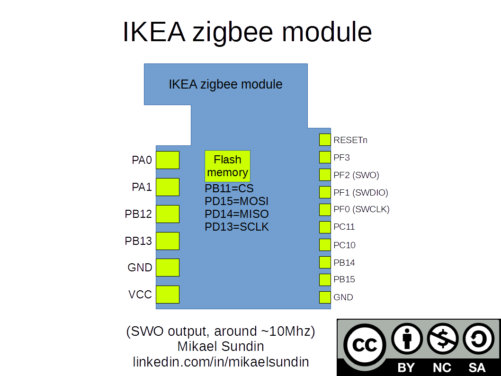
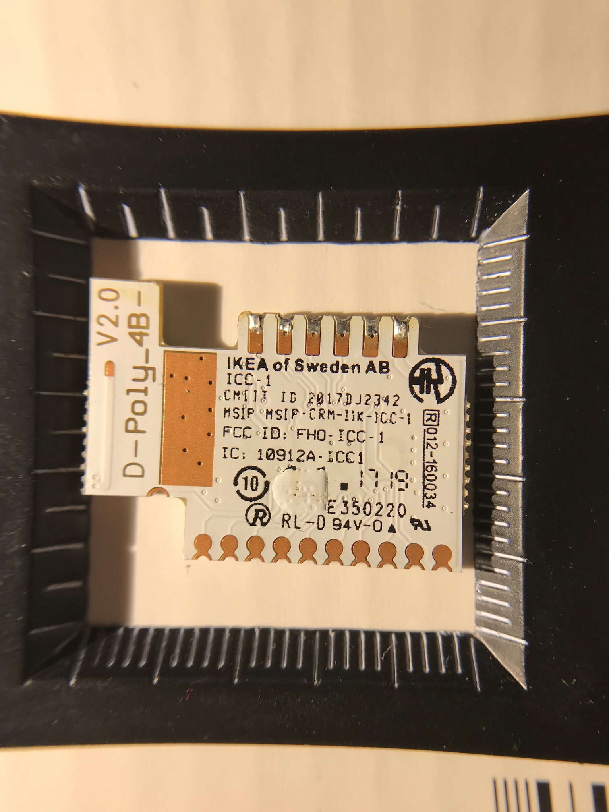
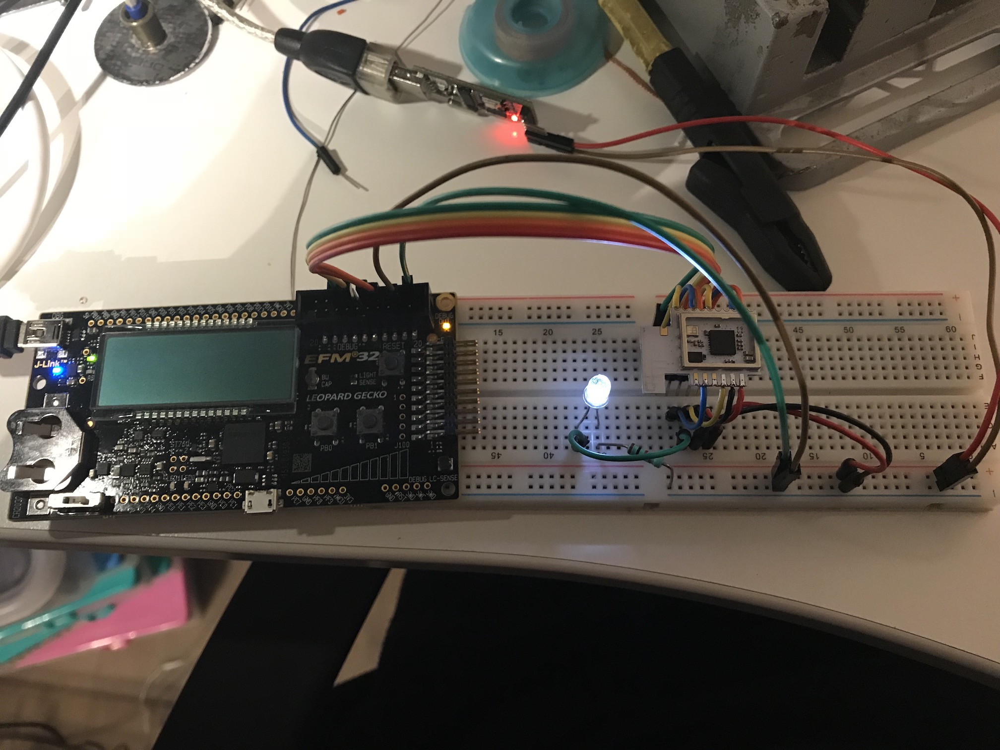

# Hacking the IKEA TRÅDFRI

* [Introduction](#introduction)
* [Components](#components)
* [Pinout](#pinout)
* [Flashing using JTAG](#flashing)
* [Software used](#software-used)
* [Custom firmware](#custom-firmware)
* [Isolation](#isolation)
* [Pictures](#pictures)
* [Relevant sources](#relevant-sources)
* [License](#license)

## Introduction
The [IKEA TRÅDFRI](http://www.ikea.com/us/en/catalog/categories/departments/lighting/36812/) family of products provide you with several lighting solutions that interconnect using [ZigBee Light Link](http://www.zigbee.org/zigbee-for-developers/applicationstandards/zigbee-light-link/).

If we take a simple GU10 light bulb, it contains:

* Power supply
* LED driver
* IKEA TRÅDFRI module

The tiny module is used in many of their products, and is actually a small piece board with some GPIO exposed. This board uses the energy-efficient Silicon Labs [EFR32MG1P132F256GM32](https://www.silabs.com/products/wireless/mesh-networking/efr32mg-mighty-gecko-zigbee-thread-soc/device.efr32mg1p132f256gm32) microcontroller (MCU), which is a ARM Cortex M4 with 256 KiB of flash.

You can take out the board, and hook it up to your own lighting solutions. Or, you can flash it with your [own firmware](#custom-firmware), for other purposes.

To find relevant products, I have compiled a [list of IKEA TRÅDFRI products](MODELS.md) (please help me to update this list).

## Components
I have been able to following parts on a single IKEA TRÅDFRI module:

* Microcontroller: [EFR32MG1P132F256GM32](https://www.silabs.com/products/wireless/mesh-networking/efr32mg-mighty-gecko-zigbee-thread-soc/device.efr32mg1p132f256gm32)
* 2Mbit SPI Flash: [IS25LQ020B](http://www.issi.com/WW/pdf/25LQ025B-512B-010B-020B-040B.pdf)
* Crystal: 38.4 MHz

I'm not entirely sure about the flash, but at least the JEDEC ID command and Product ID command (see table 8.4) match up when tested.

## Pinout
I found a pinout on [this website](https://tradfri.blogspot.nl).



## Flashing using JTAG
To connect to an external JTAG/SWD debugger, connect as follows:

* PF0 -> SWCLK
* PF1 -> SWDIO
* PF2 -> SWO
* RESETn -> RESETn
* GND -> GND
* VCC -> VCC (3v3)

In my case, I could leave the module in the light bulb, but for flashing I provided my own power supply by hooking it up to the VCC line directly.

I'm working on a small PCB that can host a TRÅDFRI module. You can find it in [the pcbs folder](pcbs/devboard).

## Software used
You can use software like [JLink](https://www.segger.com/products/debug-probes/j-link/) or [OpenOCD](http://www.openocd.org) to flash the target.

If you use JLink, you can use the command below to connect to the board:

```
JLink -If SWD -Speed 5000 -Device EFR32MG1PXXXF256
```

To dump the flash contents, use the command below (0x4000 is 256 KiB):

```
savebin output.bin 0x0 0x4000
```

To load a flash from file, use the following command:

```
loadbin output.bin
verifybin output.bin 0x0
```

I have confirmed that you can dump the flash, erase the device and load it again, and the light bulb will still work.

## Custom firmware
The chip is a normal Cortex M4. You can flash it with anything. As a starting point, you could take a look at [this pull request](https://github.com/RIOT-OS/RIOT/pull/8047) for RIOT-OS. To get started.

I've added some firmwares in the [firmwares](firmwares/) folder.

As a proof of concept, check out [this YouTube video](https://www.youtube.com/watch?v=yi_Z2WtmdDU) I made. In there, I show how I control the LED connected via a serial console.

## Isolation
If you plan to leave the board in-place, and run your own light bulb firmware, never connect external devices (e.g. debugger or serial adapter) to a light bulb that is plugged in. Due to different voltage levels, you could destroy your devices.

If you want to connect an external device, ensure that it is properly isolated (e.g. using a optocoupler).

I have designed a board that you could use to isolate UART signals. You can find it [here](pcbs/isolator).

## Pictures
Front of the TRÅDFRI module:


Back of the TRÅDFRI module:



My setup (the small board is a UART isolator):


My safer setup, including debugger (LED is connected to same pin as it would in the GU10 light):



## Relevant sources
I have gathered some information from the following sources:

* [IKEA Trådfri hacking](https://tradfri.blogspot.nl)
* [Trådfri: ESP8266-Lampen-Gateway](https://www.heise.de/make/artikel/Ikea-Tradfri-Anleitung-fuer-ein-ESP8266-Lampen-Gateway-3598411.html)

## License
Creative Commons BY Attribution 4.0 International
